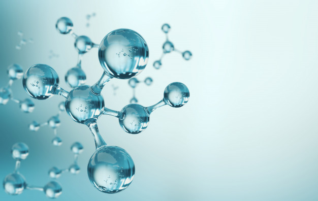

  

# Antibiotic drug discovery using Machine Learning
## By Lihi Gur-Arie

Due to the rapid emergence of antibiotic-resistant bacteria, there is a growing need to discover new antibiotics. 
Protein synthesis is a crucial process to the bacteria survival, and molecules that inhibit the bacterial ribosome are attractive candidates as antibiotics. 
In this research I deployed machine learning algorithms to predict molecular affinity of small molecules to the bacterial ribosome.

#### Features extraction:
204 molecular features were calculated for each molecule, using RDKit library. 

#### Algorithm selection:
Several SciKit algorithms were compared and evaluated. LASSO model had the best performance. 

#### Algorithms:
Three final models were used to predict molecular binding:
* **Deep Neural Network** - for continuous binding score prediction (regression).
* **LASSO regression** - for continuous binding score prediction (regression).
* **Decision Tree** -  to predict binding (classification) and for explainability purposes.

#### Features selection:
Features were selected differently for each of the three ML algorithm.

*This repository contains code portions that were used to predict molecular affinity. The scientific paper describing the process is yet to be published. The data is still confidential and not included in the repositoy*
